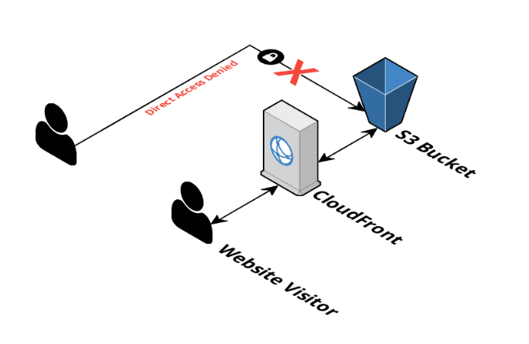

# aws-terraform-secure-s3-website-with-cloudfront

A complete Terraform stack to deploy a serverless static website, hosted from AWS in a secured s3 bucket, only accessible via CloudFront (no direct bucket access).

This stack should be used as a quickstart, and may require some additional tweaking to suit your needs (outside of hosting a simple single secure static website).

### Variables

Name|Type|Description|
|---|---|---|
|name|string|Specify the name of the stack/project|
|region|string|Defaults to `us-east-1`|
|s3_bucket_name|string|Set this to use a specific S3 bucket, else leave as default and a new bucket will be created.|
|environment|string|Used to determine the environment type, e.g. Development, Staging, Production etc.|
|cloudfront_aliases|list|Specify a list of CNAMEs to be associated with the site, else leave empty to use *.cloudfront.net.|
|cloudfront_certificate_arn|string|If cloudfront_aliases are defined, a ACM Certificate will also be required.|
